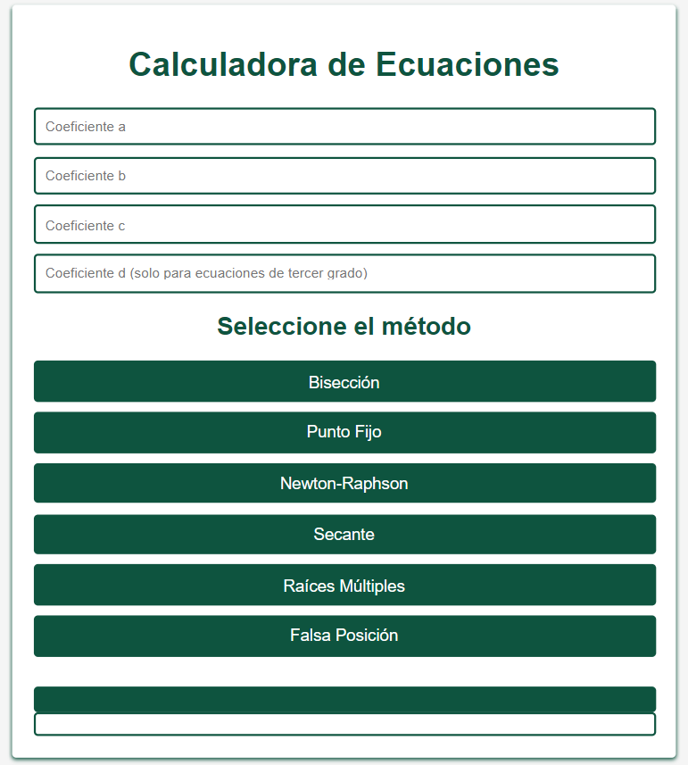
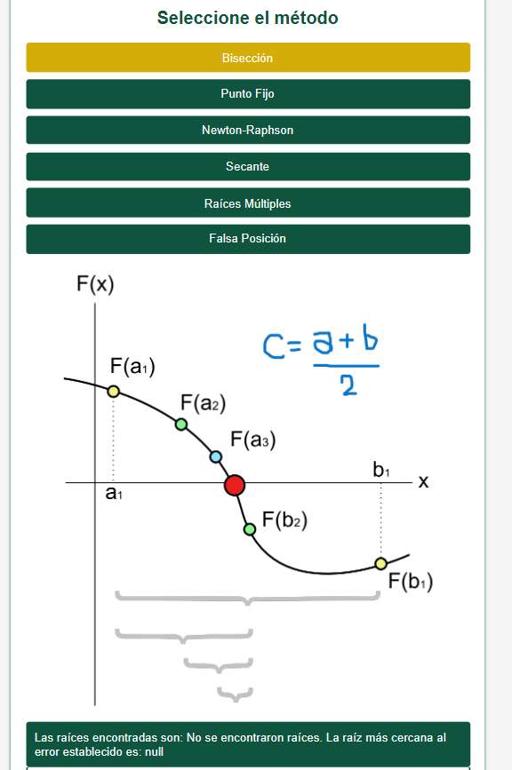
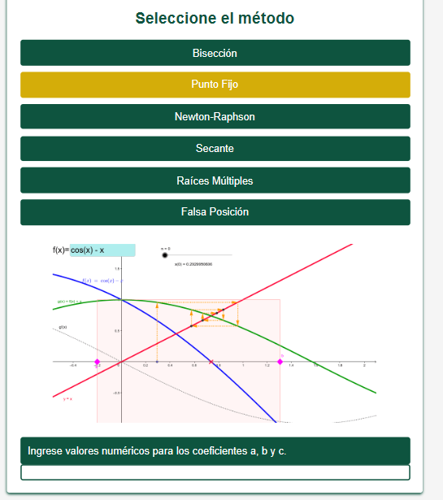
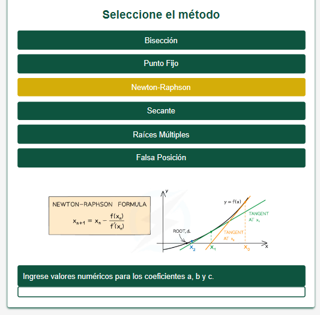
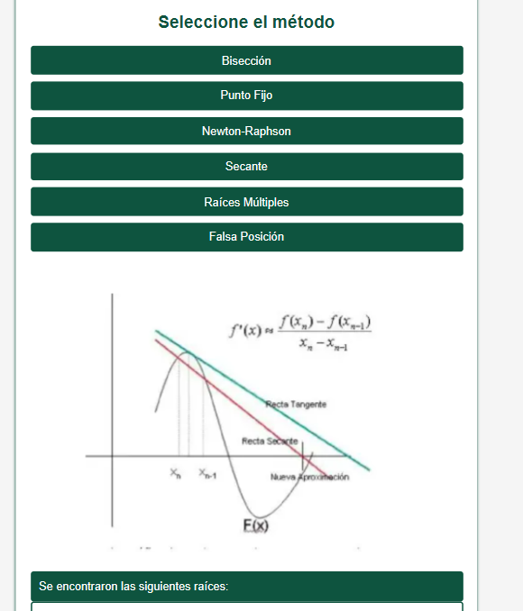
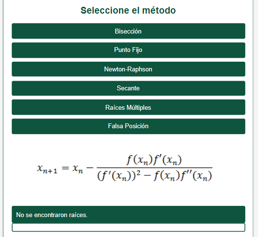
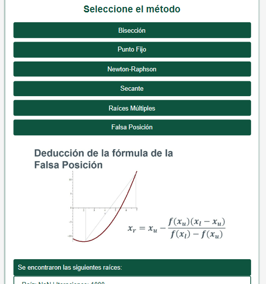

# Calculadora de Ecuaciones V2
Este proyecto fue creado para la entrega final del semestre de la materia de Modelos Matemáticos, el propósito de esta práctica fue crear una herramienta que te permite resolver ecuaciones cúbicas y de segundo grado utilizando diferentes métodos numéricos.

Esta es la segunda versión del proyecto, creada en otro lenguaje, con el fin de poder acceder de manera online.

    

## Material de Apoyo
Dentro del repositorio se encuentra la carpeta `material-de-apoyo` en la que encontrarás tanto el **Manual de Usuario** como **Manual de Programador**, que te explicara el paso a paso para poder utilizar correctamente la calculadora y comprender de una manera más sencilla el proyecto y sus especificaciones. 
Igualmente podrás acceder a **Métodos Matemáticos** si buscas una explicación más amplia sobre cada método numérico utilizado y el algoritmo.

## Métodos Matemáticos:
Los métodos empleados por la calculadora son los siguientes:
* Gráfico
* Bisección
* Punto Fijo
* Newton-Raphson
* Secante
* Raíces Múltiples
* Falsa Posición
* 
## Capturas de Pantalla
### **Bisección**:

    

### **Punto Fijo**:

    

### **Newton-Raphson**:

    

### **Secante**:

    

### **Raíces Multiples**:

    

### **Falsa Posición**:

    

