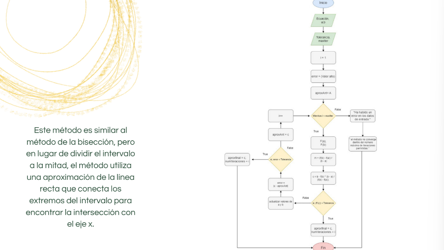

# Falsa-Posición:

.

Descripción del proceso:
1. Inicio: Comienza el programa.
2. Ingresar la ecuación: Pide al usuario que ingrese la ecuación que desea resolver.
3. Ingresar la aproximación inicial: Solicita al usuario que ingrese una aproximación inicial para la raíz.
4. Establecer la tolerancia: Pide al usuario que ingrese la tolerancia deseada para determinar cuándo se ha alcanzado una
solución aceptable.
5. Inicializar variables: Crea las siguientes variables:
  - `x0`: Aproximación inicial de la raíz.
  - `x1`: Variable para almacenar la siguiente aproximación de la raíz.
  - `error`: Variable para almacenar el error absoluto entre las aproximaciones sucesivas.
  - `tolerancia`: Valor de tolerancia ingresado por el usuario.
6. Iteración:
  - Calcula `f(x0)`: Evalúa la ecuación en la aproximación inicial `x0` para obtener el valor de la función.
  - Calcula `f'(x0)`: Calcula la derivada de la ecuación en `x0`.
  - Calcula `delta_x`: Divide `f(x0)` entre `f'(x0)` para obtener la longitud del paso.
  - Calcula `x1`: Resta `delta_x` de `x0` para obtener la siguiente aproximación de la raíz.
  - Calcula el error absoluto: Calcula `|x1 - x0|` para determinar el error absoluto entre las aproximaciones sucesivas.
  - Actualiza `x0` con el valor de `x1`.
  - Si el error absoluto es menor que la tolerancia, pasa al paso 8.
  - Si no, vuelve al paso 6.
7. Fin de la iteración: Se ha encontrado una solución aceptable.
8. Imprimir resultado: Imprime la aproximación de la raíz encontrada.
9. Fin del programa: Termina el programa.
