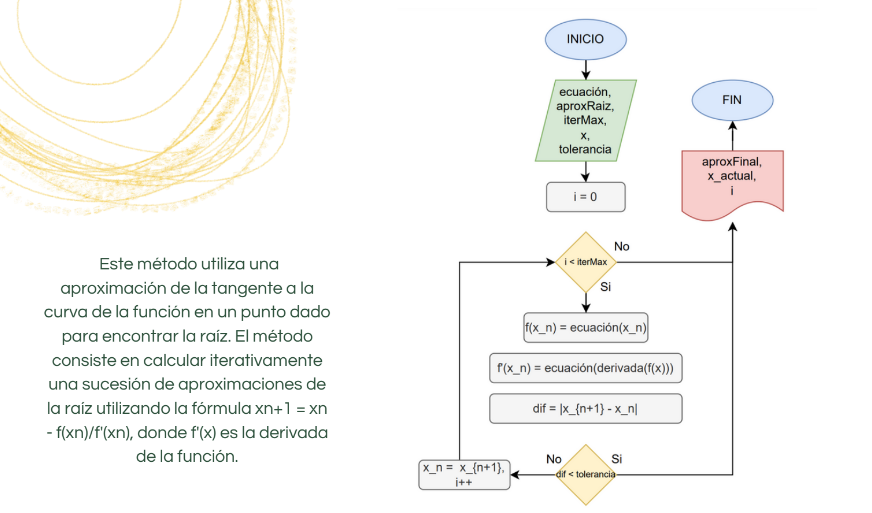

# Newton-Raphson:

Descripción del proceso:
1. Inicio: Comienza el programa.
2. Entrada: Solicita al usuario la ecuación que desea resolver y los valores iniciales para la aproximación de la raíz.
3. Inicialización: Asigna los valores iniciales a las variables necesarias para el método.
4. Iteración:
  * Establece una variable de control de iteración *(iter)* y asigna el valor 0.
  * Mientras iter sea menor que el número máximo de iteraciones permitidas:
    - Evalúa la ecuación con los valores actuales para obtener el valor de `f(x_n)`.
    - Calcula la derivada de la ecuación en el punto actual para obtener el valor de `f'(x_n)`.
    - Calcula la siguiente aproximación de la raíz utilizando la fórmula de Newton-Raphson:

          x_{n+1} = x_n -(f(x_n) / f'(x_n))
      
    - Calcula la diferencia entre la aproximación actual y la anterior: diff =` |x_{n+1} - x_n|`.
    - Comprueba si la diferencia es menor que una tolerancia predefinida: diff < TOL. Si es así, pasa al paso 5.
    - Actualiza el valor de la aproximación actual con el valor calculado en el paso anterior:  `x_n = x_{n+1}`.
    - Incrementa el contador de iteraciones *(iter = iter + 1)*
  * Si el número de iteraciones alcanza el límite máximo sin converger, muestra un mensaje de error y finaliza el
  programa.
5. Salida:
  - Muestra la aproximación final de la raíz.
  - Muestra el valor de la ecuación evaluada en la aproximación final.
6. Fin: Finaliza el programa.
