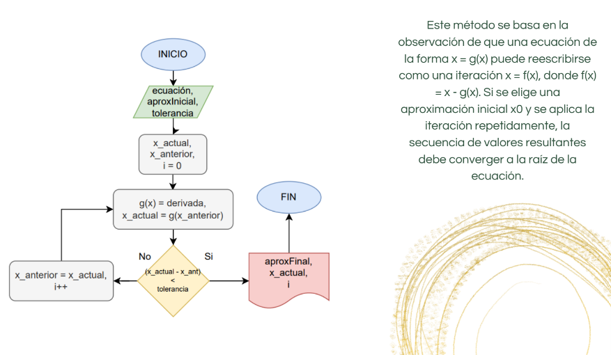

# Punto Fijo:

Descripción del proceso:
1. Inicio: Comienza el diagrama de flujo.
2. Ingresar la ecuación: Solicita al usuario que introduzca la ecuación que desea resolver. Puedes utilizar un cuadro de entrada de datos para que el usuario ingrese la ecuación.
3. Ingresar la aproximación inicial: Pide al usuario que ingrese un valor inicial para comenzar el proceso de iteración. Esto será utilizado como punto de partida para encontrar la solución.
4. Establecer tolerancia: Establece un valor de tolerancia para determinar cuándo el resultado obtenido es lo suficientemente cercano a la solución exacta. Puedes utilizar un cuadro de entrada de datos para que el usuario ingrese la tolerancia deseada.
5. Inicializar variables: Crea las variables necesarias y asígnale los valores iniciales. Estas variables incluirán:
  - `x_actual`: Almacena el valor actual de la aproximación.
  - `x_anterior`: Almacena el valor anterior de la aproximación.
  - `iteraciones`: Contador de iteraciones.
  Inicializa `x_actual` con el valor ingresado por el usuario como aproximación inicial.
  Inicializa `x_anterior` con 0.
  Inicializa `iteraciones` en 0.
6. Iteración: Inicia un bucle iterativo que se repita hasta que se cumpla una condición de salida.
7. Calcular nueva aproximación: Calcula una nueva aproximación utilizando el método de punto fijo. Aplica la fórmula: `x_actual = g(x_anterior)` donde *g(x)* es una función derivada de la ecuación original. Puedes proporcionar una fórmula específica para *g(x)* en función de la ecuación dada. Utiliza la variable `x_anterior` para calcular el nuevo valor de `x_actual`.
8. Verificar convergencia: Compara la diferencia absoluta entre la nueva aproximación `(x_actual)` y la aproximación anterior `(x_anterior)` con la tolerancia establecida. Utiliza la condición: `abs(x_actual - x_anterior) < tolerancia`. Si la condición es verdadera, se considera que la solución ha convergido y se pasa al siguiente paso. De lo contrario, se actualiza el valor de `x_anterior` con el valor de `x_actual`, se incrementa el contador de iteraciones en 1 y se vuelve al paso 7.
9. Mostrar resultado: Muestra la solución encontrada, que es la aproximación final que cumple con la tolerancia establecida. Puedes imprimir el valor de `x_actual` como la solución encontrada.
10. Fin: Finaliza el diagrama de flujo.

